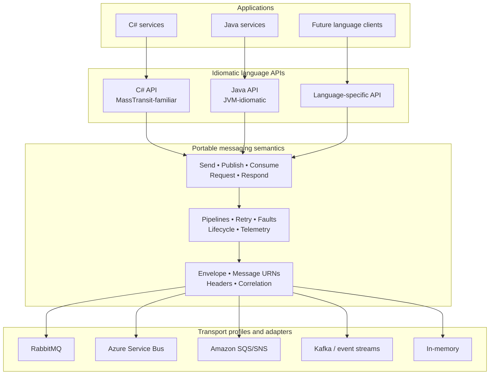
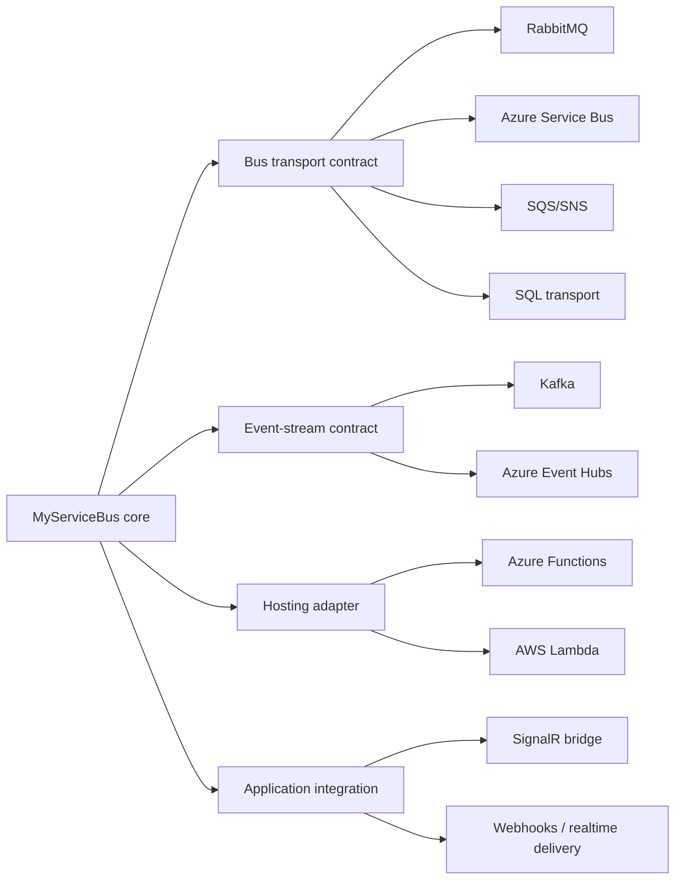
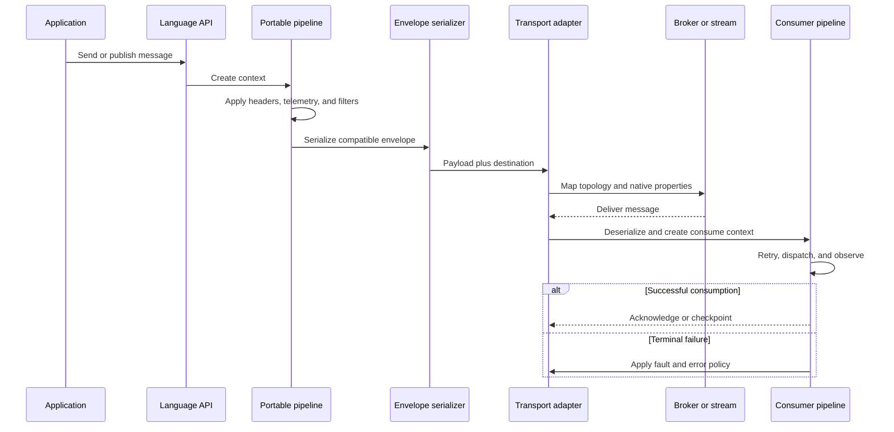
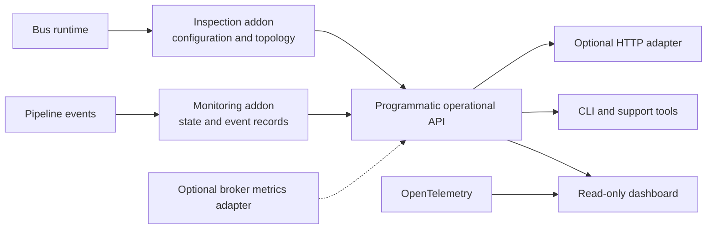

# MyServiceBus Architecture

MyServiceBus is a cross-language messaging runtime with a transport-independent application model and a MassTransit-compatible protocol profile. C# and Java are the reference implementations. Future clients should implement the same language-neutral specification using APIs that are idiomatic for their platforms.

The architecture deliberately separates compatibility, portable messaging behavior, broker integration, and optional operational tooling. This allows the project to interoperate with MassTransit without treating every MassTransit feature or historical API as a requirement.

## Architectural Principles

- **Wire compatibility is the strongest compatibility promise.** Compatible clients preserve the MassTransit envelope, message identity, headers, addressing, correlation, request/response, and fault conventions defined by the selected transport profile.
- **The portable core is intentionally smaller than MassTransit.** Send, publish, consume, request/response, retries, faults, pipelines, serialization, telemetry, and lifecycle form the common messaging model.
- **Language APIs are idiomatic.** C# remains familiar to MassTransit users, while Java and future clients express the same concepts using conventions natural to their ecosystems.
- **Transports declare capabilities.** The core does not assume every broker supports queues, fan-out, scheduling, ordering, replay, and dead-lettering in the same way.
- **Operational tooling is optional.** Inspection, monitoring, and dashboard packages observe the runtime through stable APIs without becoming dependencies of message delivery.
- **The specification, fixtures, and conformance suite are the cross-language source of truth.** No single client implementation defines the protocol by accident.

## Layered Architecture

The portable semantic layer owns application-visible behavior. A transport adapter owns addressing, topology, settlement, native headers, delivery constraints, and connection management. The envelope is portable; broker topology is not.

## Compatibility Model

Compatibility is described at distinct levels so that claims remain precise and testable.

The complete definitions, immediate target, status labels, and required test matrix are normative in the [Compatibility Policy](compatibility.md).

| Level | Promise | Verification |
| --- | --- | --- |
| Wire compatibility | Read and write the MassTransit envelope and message conventions | Canonical envelope fixtures and round-trip tests |
| Semantic compatibility | Preserve the meaning of send, publish, consume, request/response, retries, and faults where capabilities allow | Behavioral conformance scenarios |
| Transport-profile interoperability | Match MassTransit addressing, topology, and broker behavior for a named transport | MyServiceBus-to-MassTransit integration tests |
| API familiarity | Present recognizable concepts, especially in C# | API review and usage walkthroughs |
| Cross-language parity | Provide the same portable behavior using idiomatic language APIs | C#↔Java and future-client test matrices |

Compatibility does not require source compatibility with MassTransit or implementation of its complete API. Unsupported features must be documented, and unsupported transport semantics must fail during configuration instead of being silently weakened.

## Transport Architecture

Durable brokers, event streams, hosting adapters, and real-time integrations are related but different extension categories.

### Bus Transports

Bus transports support some combination of directed delivery, publish/subscribe, competing consumers, acknowledgement, retries, and error destinations. RabbitMQ is the first reference transport. Azure Service Bus and SQS/SNS are candidates for subsequent profiles.

### Event Streams

Kafka and similar systems use topics, partitions, keys, offsets, checkpoints, and consumer groups. These concepts should not be hidden behind queue terminology. Event streams may reuse envelopes, serialization, consumers, pipelines, and telemetry while exposing a distinct producer and topic-endpoint model.

### Hosting Adapters

Serverless runtimes control message reception and application lifetime. An Azure Functions or AWS Lambda adapter connects externally delivered messages to the consume pipeline; it is not necessarily a normal, long-running receive transport.

### Application Integrations

SignalR is a transient delivery integration rather than a durable bus transport. A typical integration consumes a durable bus event and forwards it to a hub, user, group, or connection. It must not imply broker acknowledgements, durable retries, or error queues that SignalR does not provide.

## Transport Capabilities

Each adapter publishes a machine-readable capability descriptor. The initial vocabulary should include:

- directed send
- publish/subscribe
- durable delivery
- competing consumers or consumer groups
- acknowledgement or checkpointing
- request/response suitability
- native or emulated scheduling
- native or emulated redelivery
- error or dead-letter destination
- ordering scope
- replay support
- temporary endpoints
- topology provisioning

Each capability records whether it is `native`, `emulated`, or `unsupported`, plus any relevant constraints. Configuration validation compares requested bus features with this descriptor before the bus starts.

Transport profiles then add the rules needed for interoperability: address formats, entity naming, topology mapping, native-header mapping, error conventions, and settlement behavior. For example, MassTransit-compatible RabbitMQ and Azure Service Bus profiles are separate conformance targets even though both implement the portable core.

## Message Flow

## Inspection, Monitoring, and Dashboard

Operational features are first-party addons over stable programmatic contracts.

Inspection describes configured endpoints, consumers, contracts, instances, versions, and capabilities. Monitoring describes activity observed by MyServiceBus, including retries, faults, skipped messages, and error moves. Broker depth and broker-native health belong to optional broker-specific metrics adapters, not the core inspection contract.

The initial dashboard is observational. Replay, purge, topology mutation, or remote configuration require a later control-plane design with authentication, authorization, audit records, and explicit safety boundaries.

See the [Monitoring API Proposal](proposals/monitoring-api.md) for the addon design and the [Project Roadmap](roadmap.md) for the proposed delivery sequence.

## Conformance Architecture

The protocol specification should be executable through shared assets:

- canonical envelope and fault fixtures
- message-type and address fixtures
- transport-specific topology scenarios
- producer/consumer interoperability scenarios
- capability and version negotiation fixtures
- a compatibility matrix covering C#, Java, future clients, and selected MassTransit versions

A new language client or transport profile is complete only when it passes the applicable conformance suites. Feature gaps remain visible in capability metadata and the documented parity matrix.
