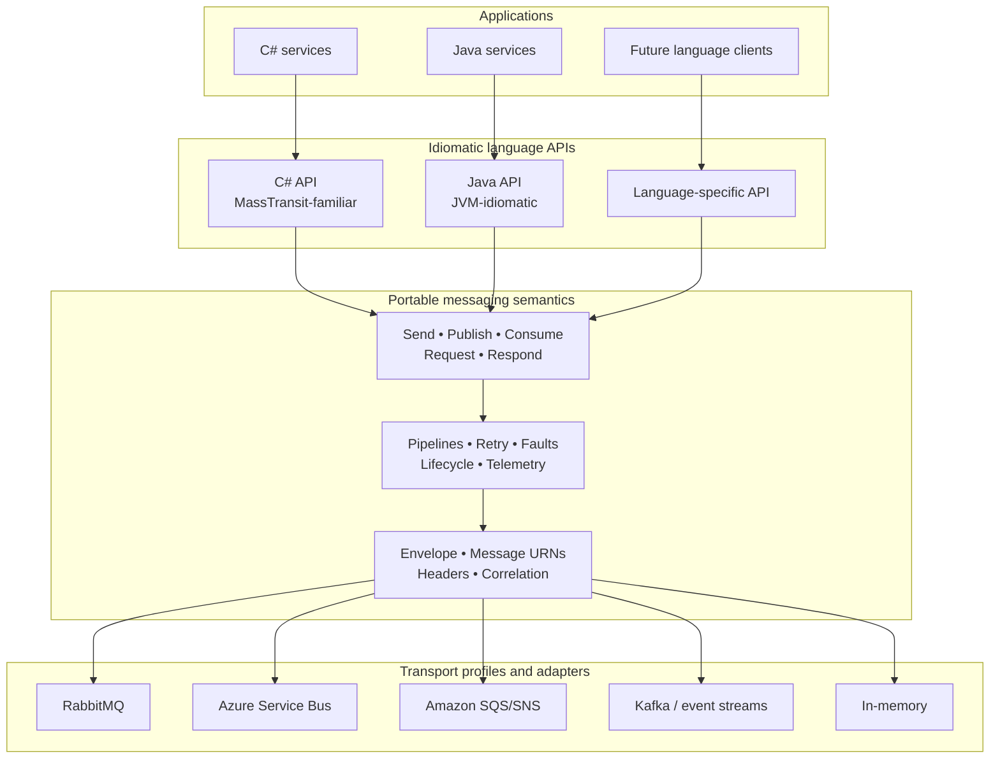
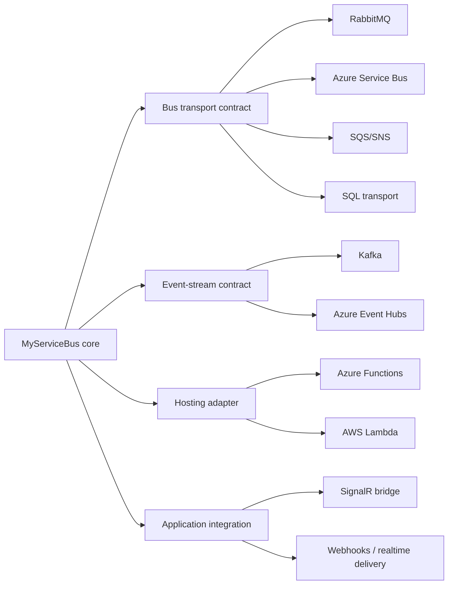
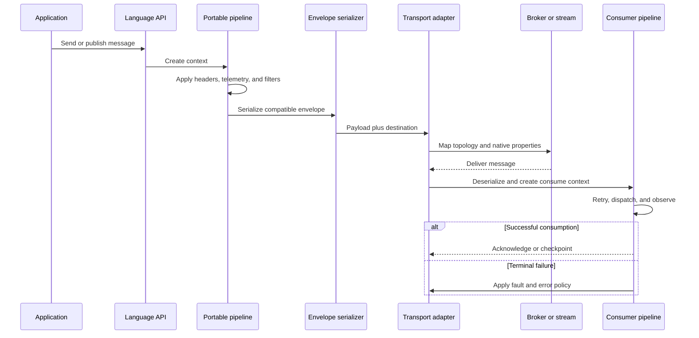
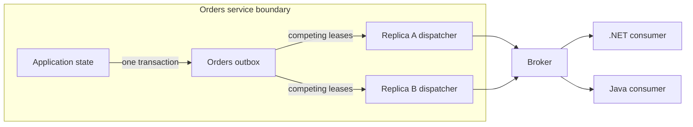
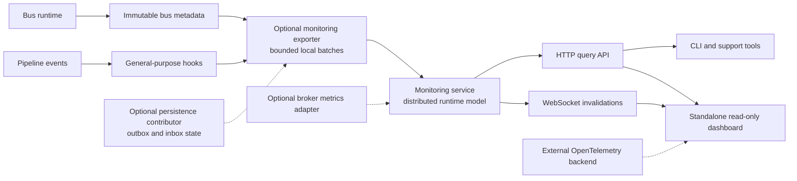

# MyServiceBus Architecture

MyServiceBus is a cross-language, broker-backed service-bus runtime with a MassTransit-compatible protocol profile. C# and Java are the reference implementations. Future clients should implement the same language-neutral specification using APIs that are idiomatic for their platforms.

The architecture deliberately separates compatibility, portable messaging behavior, broker integration, and optional operational tooling. This allows the project to interoperate with MassTransit without treating every MassTransit feature or historical API as a requirement.

The project is motivated by building on MassTransit's proven foundation while improving the areas it deliberately owns: C#↔Java parity, generated consumer dispatch, explicit compatibility and delivery evidence, and a smaller portable core. Continued permissive open-source licensing of that core is an architectural and product constraint, not merely a current packaging detail.

## Product Boundary

MyServiceBus is not intended to compete directly with MassTransit as a fully supported enterprise platform. It is a focused alternative for teams that want dependable messaging fundamentals, a smaller operational and conceptual footprint, and consistent clients across programming languages. Its two primary adoption paths are adding Java services to an existing MassTransit-based .NET estate through the verified common subset, and starting a greenfield C# and/or Java system on one shared model. Businesses may use it for production workloads, but the project does not claim MassTransit's breadth, maturity, commercial support model, or enterprise ecosystem.

The MIT license is part of that product fit. MassTransit v9 and later use commercial licensing, which can be appropriate when its support and broader capability set are required. MyServiceBus serves projects whose basic needs or current stage do not justify that commitment, while making preview maturity and support limitations explicit. The verified MassTransit 8.5.1 peer remains a technical interoperability boundary and must not be confused with the v9 licensing comparison.

Compatibility supports coexistence, incremental adoption, and migration. It is not a commitment to reproduce the entire product. Features enter the portable core because they provide current value across supported languages and transports, not merely because they exist in MassTransit. Specialized enterprise patterns remain demand-driven extensions or documented non-goals.

The primary product goal is to replace MassTransit in basic broker-backed scenarios: configure one bus, connect it to a broker, send and publish messages, consume them reliably, perform request/response, and handle retries, faults, skipped messages, and terminal errors. The normalized topology model therefore represents service-bus intent and broker projections. It is not required to model arbitrary communication technologies that have no broker topology.

HTTP callbacks, webhooks, WebSockets, SignalR, and similar technologies may eventually reuse contracts, envelopes, serialization, telemetry, or consumer pipelines. They are not bus transports merely because messages can travel through them. Generalizing the stable bus and topology APIs around those technologies would create a different product and requires separate, evidence-driven design work.

### Mediator boundary

The in-process mediator is a primary product mode over reusable handler, consumer, consumer-method, and pipeline infrastructure. It is intended to replace MediatR for local commands, queries, response handlers, and notifications, while also supporting testing, modular-monolith boundaries, lightweight tools, and gradual migration to a broker. Handler and consumer shapes are interchangeable at the execution boundary: either can run locally or behind a broker, and reflected/generated consumer methods use the same topology and pipeline. An application may adopt this mode without using or planning to use broker-backed messaging. It does not provide broker durability, independent delivery, or externally observable publication.

Application components should depend on the segregated mediator intent contract (`IMediator` in C# and `Mediator` in Java) when they need only local `Send` and `Publish`. Destination-aware operations remain on bus-specific contracts so command/query application code does not acquire transport responsibilities accidentally.

When an application already uses a broker-backed bus, events that represent facts other processes may observe should ordinarily be published on that bus. Applications should not create mediator and broker paths for the same event by default: doing so creates different retry, durability, observability, and failure semantics. Any dual path must express a deliberate architectural distinction.

Stabilizing mediator and in-memory harness semantics in both reference clients is the first implementation priority after the broker-backed MVP foundation. The [Mediator and In-Memory Stability Gate](development/in-memory-stability-gate.md) defines the required parity and conformance work.

### Multiple bus instances

The default hosting model is one application connected to one logical bus. This keeps lifecycle, endpoint ownership, topology, telemetry, and operational behavior understandable.

MassTransit supports multiple bus instances in one host through separately registered types, often marker interfaces. MyServiceBus does not currently support or plan to mirror that facility. It is not the normal application model, it would complicate lifecycle and topology ownership, and the marker-interface or keyed-registration approach does not translate naturally to the current Java dependency-injection abstraction.

Applications that require isolated buses should use separate application hosts or processes. Multiple in-process buses may be reconsidered only in response to a concrete use case and a design that remains idiomatic in both C# and Java; MassTransit compatibility alone is insufficient justification.

## Architectural Principles

- **Wire compatibility is the strongest compatibility promise.** Compatible clients preserve the MassTransit envelope, message identity, headers, addressing, correlation, request/response, and fault conventions defined by the selected transport profile.
- **Broker-backed messaging is the product boundary.** The stable bus and topology APIs model durable service-bus intent; unrelated delivery technologies do not drive those abstractions.
- **The portable core is intentionally smaller than MassTransit.** Send, publish, consume, request/response, retries, faults, pipelines, serialization, telemetry, and lifecycle form the common messaging model.
- **One bus per application is the supported model.** Multiple hosted bus instances are currently out of scope and are not added solely for MassTransit API compatibility.
- **Simplicity is a product feature.** New surface area must justify its long-term conceptual, operational, and cross-language cost.
- **Language APIs are idiomatic.** C# remains familiar to MassTransit users, while Java and future clients express the same concepts using conventions natural to their ecosystems.
- **Runtime baselines are explicit.** Modern APIs use the features available within the published target: currently .NET 10 for C# packages and Java 17-compatible bytecode/APIs for Java. A newer JDK runtime expectation is not the same decision as raising the Java publication target.
- **Integration abstractions stay small and owned.** The portable core avoids selecting a framework-specific DI or logging stack; optional adapters connect it to the ecosystems applications already use.
- **Transports declare capabilities.** The core does not assume every broker supports queues, fan-out, scheduling, ordering, replay, and dead-lettering in the same way.
- **Operational tooling is optional.** Inspection, monitoring, and dashboard packages observe the runtime through stable APIs without becoming dependencies of message delivery.
- **Topology is modeled once.** Registration, runtime provisioning, inspection, and future dashboards share a normalized topology model instead of deriving competing views from broker-specific assumptions.
- **The specification, fixtures, and conformance suite are the cross-language source of truth.** No single client implementation defines the protocol by accident.

## Layered Architecture

```mermaid
flowchart TB
    subgraph Applications["Applications"]
        CS["C# services"]
        JVM["Java services"]
        Future["Future language clients"]
    end

    subgraph APIs["Idiomatic language APIs"]
        CSAPI["C# API\nMassTransit-familiar"]
        JavaAPI["Java API\nJVM-idiomatic"]
        OtherAPI["Language-specific API"]
    end

    subgraph Core["Portable messaging semantics"]
        Operations["Send • Publish • Consume\nRequest • Respond"]
        Runtime["Pipelines • Retry • Faults\nLifecycle • Telemetry"]
        Protocol["Envelope • Message URNs\nHeaders • Correlation"]
    end

    subgraph Adapters["Transport profiles and adapters"]
        Rabbit["RabbitMQ"]
        ASB["Azure Service Bus"]
        SQS["Amazon SQS/SNS"]
        Stream["Kafka / event streams"]
        Memory["In-memory"]
    end

    CS --> CSAPI
    JVM --> JavaAPI
    Future --> OtherAPI
    CSAPI --> Operations
    JavaAPI --> Operations
    OtherAPI --> Operations
    Operations --> Runtime
    Runtime --> Protocol
    Protocol --> Rabbit
    Protocol --> ASB
    Protocol --> SQS
    Protocol --> Stream
    Protocol --> Memory
```

The portable semantic layer owns application-visible behavior and normalized topology intent. A transport adapter owns address realization, broker topology projection, settlement, native headers, delivery constraints, and connection management. Portable topology identity is shared; broker entity shape is profile-specific.

Higher-level features extend this graph through typed portable nodes. Persistence-backed behavior such as sagas and outbox policies declares stable requirements without exposing provider objects, while each broker continues to supply a separate profile projection. See the [Topology Extension Model](specs/topology-extension-model.md).

## Compatibility Model

Compatibility is described at distinct levels so that claims remain precise and testable.

The complete definitions, immediate target, status labels, and required test matrix are normative in the [Compatibility Policy](compatibility.md).

| Level | Promise | Verification |
| --- | --- | --- |
| Wire compatibility | Read and write the MassTransit envelope and message conventions | Canonical envelope fixtures and round-trip tests |
| Semantic compatibility | Preserve the meaning of send, publish, consume, request/response, retries, and faults where capabilities allow | Behavioral conformance scenarios |
| Transport-profile interoperability | Match MassTransit addressing, topology, and broker behavior for a named transport | MyServiceBus-to-MassTransit integration tests |
| API familiarity | Present recognizable concepts, especially in C# | API review and usage walkthroughs |
| Cross-language parity | Provide the same portable behavior using idiomatic language APIs | C#↔Java and future-client test matrices |

Compatibility does not require source compatibility with MassTransit or implementation of its complete API. Unsupported features must be documented, and unsupported transport semantics must fail during configuration instead of being silently weakened.

## Transport Architecture

Durable brokers, event streams, hosting adapters, and real-time integrations are related but different extension categories.

```mermaid
flowchart LR
    Core["MyServiceBus core"] --> BrokerContract["Bus transport contract"]
    Core --> StreamContract["Event-stream contract"]
    Core --> HostingContract["Hosting adapter"]
    Core --> IntegrationContract["Application integration"]

    BrokerContract --> Rabbit["RabbitMQ"]
    BrokerContract --> ASB["Azure Service Bus"]
    BrokerContract --> SQS["SQS/SNS"]
    BrokerContract --> Sql["SQL transport"]

    StreamContract --> Kafka["Kafka"]
    StreamContract --> EventHubs["Azure Event Hubs"]

    HostingContract --> Functions["Azure Functions"]
    HostingContract --> Lambda["AWS Lambda"]

    IntegrationContract --> SignalR["SignalR bridge"]
    IntegrationContract --> Webhooks["Webhooks / realtime delivery"]
```

### Bus Transports

Bus transports support some combination of directed delivery, publish/subscribe, competing consumers, acknowledgement, retries, and error destinations. RabbitMQ is the first reference transport. Azure Service Bus and SQS/SNS are candidates for subsequent profiles.

### Event Streams

Kafka and similar systems use topics, partitions, keys, offsets, checkpoints, and consumer groups. These concepts should not be hidden behind queue terminology. Event streams may reuse envelopes, serialization, consumers, pipelines, and telemetry while exposing a distinct producer and topic-endpoint model.

### Hosting Adapters

Serverless runtimes control message reception and application lifetime. An Azure Functions or AWS Lambda adapter connects externally delivered messages to the consume pipeline; it is not necessarily a normal, long-running receive transport.

### Application Integrations

SignalR is a transient delivery integration rather than a durable bus transport. A typical integration consumes a durable bus event and forwards it to a hub, user, group, or connection. It must not imply broker acknowledgements, durable retries, or error queues that SignalR does not provide.

## Transport Capabilities

Each adapter publishes a machine-readable capability descriptor. The initial vocabulary should include:

- directed send
- publish/subscribe
- durable delivery
- competing consumers or consumer groups
- acknowledgement or checkpointing
- request/response suitability
- native or emulated scheduling
- native or emulated redelivery
- error or dead-letter destination
- ordering scope
- replay support
- temporary endpoints
- topology provisioning

Each capability records whether it is `native`, `emulated`, or `unsupported`, plus any relevant constraints. Configuration validation compares requested bus features with this descriptor before the bus starts.

Transport profiles then add the rules needed for interoperability: address formats, entity naming, topology mapping, native-header mapping, error conventions, and settlement behavior. For example, MassTransit-compatible RabbitMQ and Azure Service Bus profiles are separate conformance targets even though both implement the portable core.

Message scheduling has a separate provider boundary because it may be implemented by the transport, PostgreSQL outbox persistence, Quartz.NET or Quartz Scheduler, or an external service. The default provider is volatile and callback-based. Durable providers receive message intent rather than an executable callback and must make restart and cancellation capabilities explicit. PostgreSQL outbox capture currently persists one-time delayed intent; persisted cancellation, recurring schedules, and provider-specific adapters remain future slices.

## Message Flow

```mermaid
sequenceDiagram
    participant App as Application
    participant API as Language API
    participant Pipe as Portable pipeline
    participant Ser as Envelope serializer
    participant Adapter as Transport adapter
    participant Broker as Broker or stream
    participant Consumer as Consumer pipeline

    App->>API: Send or publish message
    API->>Pipe: Create context
    Pipe->>Pipe: Apply headers, telemetry, and filters
    Pipe->>Ser: Serialize compatible envelope
    Ser->>Adapter: Payload plus destination
    Adapter->>Broker: Map topology and native properties
    Broker-->>Adapter: Deliver message
    Adapter->>Consumer: Deserialize and create consume context
    Consumer->>Consumer: Retry, dispatch, and observe
    alt Successful consumption
        Consumer-->>Adapter: Acknowledge or checkpoint
    else Terminal failure
        Consumer->>Adapter: Apply fault and error policy
    end
```

## Transactional Messaging Boundary

The transactional outbox belongs to a **logical producing service**. Its application state and outgoing messaging intent commit in the same database transaction. Every record has a service partition key. Replicas share that partition and compete for leases; unrelated services may use other partitions in the same database without reading or dispatching those records.

```mermaid
flowchart LR
    subgraph Producer["Orders service boundary"]
        App["Application state"]
        Outbox["Orders outbox"]
        ReplicaA["Replica A dispatcher"]
        ReplicaB["Replica B dispatcher"]
        App -->|"one transaction"| Outbox
        Outbox -->|"competing leases"| ReplicaA
        Outbox -->|"competing leases"| ReplicaB
    end

    ReplicaA --> Broker["Broker"]
    ReplicaB --> Broker
    Broker --> DotNet[".NET consumer"]
    Broker --> Java["Java consumer"]
```

The PostgreSQL schema is one normalized MyServiceBus provider contract shared by the C# and Java implementations, so either implementation can write or lease a configured service partition. It is not a cross-service integration API: other services still communicate through the broker. The outbox stores the final serialized envelope, dispatch treats its body as opaque bytes, and the transport preserves content type, message identity, correlation, and reply metadata. A .NET or Java consumer then deserializes the same public wire contract. Live RabbitMQ gates verify persisted .NET envelopes consumed by Java and persisted Java envelopes consumed by .NET.

The matching inbox belongs to the consuming service boundary. It commits the consumer's protected database effects, completed message identity, and any resulting outgoing outbox records together. Delivery remains at least once across the broker/database acknowledgement gap; stable message identity and inbox deduplication make protected database effects repeat-safe.

A centralized dispatcher shared by unrelated services is possible only as an explicit deployment design. It must be configured for those service partitions and requires authorization, schema ownership, independent failure isolation, and operational accountability; it is not the default MyServiceBus model. See the [Transactional Outbox and Inbox guide](transactional-outbox.md) and its [normative specification](specs/outbox-inbox.md).

## Inspection, Monitoring, and Dashboard

Operational features are first-party addons over stable programmatic contracts.

```mermaid
flowchart LR
    Runtime["Bus runtime"] --> Inspection["Immutable bus metadata"]
    Pipelines["Pipeline events"] --> Hooks["General-purpose hooks"]
    Inspection --> Exporter["Optional monitoring exporter\nbounded local batches"]
    Hooks --> Exporter
    Persistence["Optional persistence contributor\noutbox and inbox state"] -.-> Exporter
    Exporter --> Service["Monitoring service\ndistributed runtime model"]
    BrokerAdapter["Optional broker metrics adapter"] -.-> Service
    Service --> Query["HTTP query API"]
    Service --> Live["WebSocket invalidations"]
    Query --> CLI["CLI and support tools"]
    Query --> Dashboard["Standalone read-only dashboard"]
    Live --> Dashboard
    Telemetry["External OpenTelemetry backend"] -.-> Dashboard
```

Inspection describes configured endpoints, consumers, contracts, instances, versions, and capabilities. General-purpose immutable hooks expose bus activity to any addon or application handler. The monitoring exporter is one hook implementation: it buffers bounded batches and sends them to the central service. Applications do not store monitoring history or expose monitoring query endpoints. Broker depth and broker-native health belong to optional broker-specific metrics adapters, while outbox and inbox state belongs to optional persistence-provider contributors. The monitoring read model may correlate these views, but it does not take ownership of dispatch or persistence.

Inspection must consume the stable topology query API. It must not infer endpoint durability, exchange types, addresses, or terminal destinations from a broker scheme or naming suffix. The normalized model and transport projection are defined in the [Topology Model Specification](specs/topology-model-spec.md).

The initial dashboard is observational. Replay, purge, topology mutation, or remote configuration require a later control-plane design with authentication, authorization, audit records, and explicit safety boundaries.

See the [Runtime Monitoring Proposal](proposals/runtime-monitoring.md) for the addon design and the [Project Roadmap](roadmap.md) for the proposed delivery sequence.

## Conformance Architecture

The protocol specification should be executable through shared assets:

- canonical envelope and fault fixtures
- message-type and address fixtures
- transport-specific topology scenarios
- producer/consumer interoperability scenarios
- capability and version negotiation fixtures
- a compatibility matrix covering C#, Java, future clients, and selected MassTransit versions

A new language client or transport profile is complete only when it passes the applicable conformance suites. Feature gaps remain visible in capability metadata and the documented parity matrix.
