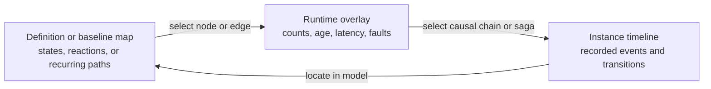

# Runtime Monitoring

MyServiceBus Monitoring is an optional, experimental addon that builds a runtime view of one distributed application from its participating services and sub-applications. Those participants export current bus metadata, heartbeats, and bounded batches of observations to one central service. The standalone dashboard queries that service; it never connects to the participants directly.

```text
C# and Java applications
  -> general-purpose bus hooks
  -> optional monitoring exporters
  -> monitoring service (read model, optional PostgreSQL history, and HTTP API)
  -> standalone Blazor dashboard
```

Messaging does not depend on this path. If the monitoring service is unavailable or an export fails, message processing continues.

## Monitoring Service Boundary

The monitoring service is first a collector and owner of monitoring data. Exporters send versioned application metadata, heartbeats, observations, and provider snapshots to it; the service validates and retains those inputs using volatile memory or its configured durable provider. Query clients retrieve data from the service rather than reaching back into applications.

The service is also the owner of shared monitoring projections. It constructs application and endpoint summaries, time-window metrics, observed flow, declared-workflow graphs, snapshots, diagnostics, and eventually recurring workflow-pattern candidates from retained inputs. The Dashboard owns presentation and interaction—not the semantic identification of a workflow, connection, or deviation. This keeps the HTTP API useful to other dashboards, CLIs, support tools, and integrations and prevents each client from inventing a different model.

Alerting is a separate future service that consumes monitoring data. It will own rule evaluation and alert lifecycle concerns such as thresholds, deduplication, suppression, acknowledgement, recovery, notifications, and audit. It should consume supported snapshots, queries, or a future durable change feed from monitoring rather than connect to application exporters or read the monitoring database directly. The current WebSocket stream only invalidates Dashboard reads and is not a durable alert feed.

A projection may be calculated on demand, incrementally maintained, or cached briefly. Those are internal optimization choices as long as the query preserves explicit capture time, window, freshness, completeness, and bounded-staleness semantics. The current summary and declared-choreography projections use a five-second HTTP output cache; ingest and retained source records are not rewritten into projected truth.

## MVP Status

The proof of concept is suitable to ship as an **experimental MVP**, not as a production monitoring system. The end-to-end Aspire stack has been exercised with C# and Java clients, RabbitMQ, the collector, HTTP queries, the WebSocket invalidation stream, and the Blazor dashboard.

The MVP includes:

- automatic application and instance registration from bus metadata
- first-class receive-endpoint summaries with replica availability, consumers, message types, addresses, transport, and current activity
- instance heartbeats and online/offline leases
- bounded client queues and interval/count-based observation batches
- cumulative and time-window sent, published, consumed, faulted, and retry metrics
- five-minute real-time throughput series with five-second buckets
- automatic replica grouping by application name and optional resource labels
- per-replica throughput, load share, p95 consume duration, retries, and failures
- observed cross-application message-flow reconstruction from correlation identifiers
- an interactive D3 message-flow map with live topology updates and throughput-weighted paths
- expandable failed-message metadata with endpoint, retry, exception, correlation, and trace details
- recent observations with optional W3C trace and span identifiers
- batch deduplication and reported dropped-observation counts
- HTTP ingest and query APIs
- WebSocket change invalidations
- a directed, responsive Blazor dashboard with persisted light, dark, and system themes plus a comfortable or compact density preference
- application Overview, Metrics, and Flow drill-downs that progressively reveal messaging detail
- equivalent exporter behavior for C# and Java
- first-class outbox dispatcher operations for embedded and standalone workers, including latest backlog, oldest-undispatched age, windowed throughput, failures, lost leases, and cycle latency
- transparent history freshness, coverage, and durability status
- an optional Entity Framework Core PostgreSQL history provider with automatic migrations, deduplicated batches, bounded retention, and active-window restoration after restart

The MVP does not yet include authentication, general long-range historical metric queries, alerting or scaling recommendations, broker queue depth, host saturation, broker administration, or payload-byte limits. PostgreSQL adds durable collection, restart recovery, and retained workflow-run drill-down; other metric queries still expose only the active 15-minute read-model window. The dashboard uses WebSocket invalidations to re-query HTTP snapshots, with a 15-second polling fallback.

## Dashboard Experience

The dashboard is both an operations tool and a development tool for understanding and debugging a distributed application. Its main objects are the distributed application and the services or sub-applications that participate in it—not bus instances. It is not primarily a bus-administration console. The monitoring service keeps precise MyServiceBus terms and identities, while the dashboard progressively reveals endpoints, buses, transports, and topology when they explain participant behavior.

The intended discovery path is:

1. **System** — is the distributed application healthy, active, and sufficiently observed?
2. **Service or sub-application** — what role is this participant playing, and what is happening to it?
3. **Messaging behavior** — what is it handling, sending, retrying, or failing?
4. **Topology and bus detail** — which endpoints, connections, and paths explain that behavior?
5. **Broker infrastructure** — what broker state contributes to it, once a separately configured provider exists?
6. **Controls** — what guarded operational action is appropriate, once an explicit control plane exists?

The landing page is deliberately an overview rather than a wall of diagnostics. It answers five questions at a glance:

- how many applications and replicas are participating
- how quickly messages are being handled now
- whether recent failures or retries need attention
- whether monitoring coverage is complete
- where to go for the next level of detail

The overview uses compact, reusable widgets for summary, throughput, current concerns, and drill-down links. Each widget has a stable internal identity so a future layout configuration can arrange known widgets without coupling configuration to Razor component names. User-defined JSON layouts are intentionally not exposed yet; the default information hierarchy needs to mature first.

Each application has its own progressive drill-down:

- **Overview** shows replicas, receive endpoints, current rate, latency, failures, busiest receiving paths, and secondary messaging-connection context.
- **Metrics** expands that application's throughput graph and ranks its receive endpoints without presenting endpoint activity as consumer-level metrics.
- **Flow** groups every replica of the selected application inside its application boundary, adds the directly observed neighboring replicas, and preserves exact replica paths in a table.

System-wide focused views remain available when the operator needs to compare applications or inspect a domain:

- **Applications** explains logical applications and replicas, then compares load, latency, retries, failures, runtime, and transport.
- **Receive endpoints** combines exported topology with current activity so configured, offline, healthy, and faulting endpoints remain distinguishable.
- **Throughput** expands the compact landing-page chart into a five-minute streamed graph and application rate breakdown.
- **Message flow** defaults to applications and observed message paths, with throughput encoded in line weight and exact rates available alongside the map. Its **Detailed** mode expands replicas into application groups and draws the directly correlated replica-to-replica paths.
- **Failures** exposes bounded failure and retry metadata without capturing message bodies or arbitrary headers.
- **Outbox** separates dispatcher backlog and delivery pressure from broker transit and consumer processing.

Graphs and maps are a continuing dashboard theme. They are implemented as distinct components rather than being embedded into individual pages, which keeps compact overview variants and full drill-down variants consistent. New domains such as sagas should follow the same shape: add only a concise health signal to the overview when it is broadly actionable, and put state distribution, transitions, faults, and correlations in a focused view.

Workflows are a focused dashboard domain with separate **Workflow runs** and **Declared workflows** tabs. The runs tab is the operational entry point: it queries the monitoring-owned retained projection with server-side type, status, and identity filters plus pagination, then links directly to a stable run detail with the D3 activity diagram and ordered evidence. The declared tab is the stable catalog: its definition map groups reactions by participating application, connects consumed triggers to declared outputs and matching downstream participants, and keeps versions, definition conflicts, replica availability, capture freshness, and aggregate exact-causation evidence visible. Silence is labeled as no exact evidence, never as a missed reaction, failed workflow, or authoritative state. An orchestration view can additionally use persisted saga identity and transition evidence to show authoritative current state, transition history, pending timeouts or requests, faults, and completion. Both reuse maps, timelines, contract nodes, causal edges, and application drill-downs while preserving the distinction between reconstructed and persisted truth.

Dashboard density is a local presentation preference. **Comfortable** remains the default; **Compact** tightens navigation, headings, cards, tables, filters, and workflow detail for operators who prefer more information at once or use smaller screens. It does not change query windows, retention, aggregation, or monitoring semantics.

The same domain can eventually include a **Discovered patterns** view for systems that have no formal workflow definition. Repeated causal paths may be grouped into workflow-shaped candidates and shown with their time window, sample count, participating applications and contracts, confidence, and coverage. The dashboard must label these as recurring observed patterns rather than declared choreography. It may help an owner draft a declaration, but it must not create or register one automatically.

After a candidate has enough support, a comparison overlay can show traffic breaking out of its usual shape: new participants or contracts, a rare branch, changed fan-out, a novel cycle, or absence of the usual continuation. That is a deviation from a selected baseline, not proof of failure. The visualization must keep the baseline window and versions visible, distinguish exact from heuristic evidence, account for incomplete or stale exporters, and open the causal records behind the deviation. Deployments, feature flags, version skew, and valid low-frequency paths should remain plausible explanations rather than being hidden by an anomaly label.

The useful navigation is aggregate to instance and back: begin with workflow health and state or step distribution, select an unhealthy path, inspect the participating services and causal messages, and—only where a saga owns the lifecycle—open the corresponding persisted instance. Instance identifiers and histories remain bounded operational data subject to authentication, retention, and redaction. Visibility does not authorize retrying, compensating, forcing a transition, or terminating a workflow; those are future control-plane operations.

### Workflow visualization model

The focused workflow experience should combine three synchronized views instead of forcing every fact onto one graph:

1. **Definition or baseline map** — the relatively stable model. A choreography map groups declared reaction steps by owning application; a discovered-pattern map shows a clearly labeled, time-bounded recurring shape; and an orchestration map renders state-machine states and event-labeled transitions, including initial, final, timeout, and fault paths.
2. **Runtime overlay** — aggregate recorded evidence on the definition or selected baseline. State nodes can show current instance counts, fault counts, and oldest age; reaction or transition edges can show observed count, latency, and evidence confidence. Missing declaration, missing observation, or a breakout from a recurring pattern appears as a diagnostic overlay rather than silently changing the underlying map.
3. **Instance timeline** — the ordered record for one selected causal chain or saga instance. It shows consumed events, state before and after a transition, activities, outgoing messages, schedules, retries, persistence conflicts, faults, and completion with timestamps and owning application.



### Workflow run analysis

`Workflow` is the collective query and presentation term for a declared coordination flow. Monitoring still stores and exposes choreography declarations and reconstructed runs separately from saga definitions, instances, and transitions. A workflow query projects both sources into a shared catalog and run index with an explicit implementation kind; selecting an item then exposes the stronger kind-specific model. This preserves bus terminology and authoritative saga state while allowing operators to search and follow either coordination style from one Dashboard surface.

The first orchestration-facing query follows that rule: `GET /api/monitoring/v1/sagas` returns registered state-machine definitions, endpoint attachments, replica counts, availability, and definition conflicts. It contains no choreography fragments and makes no claim about saga instances or transitions. Those lifecycle records will use their own saga monitoring model before they are referenced by the shared workflow query.

The first choreography drill-down now lets an operator select one bounded causal chain and inspect it as a **workflow run** in the Dashboard. This is a presentation and monitoring projection over recorded messages, not a new choreography runtime or durable business-process instance. A D3 activity diagram places consumer activities in application swimlanes and connects them with causal message handoffs. The ordered detail list remains below it so branches are visible without hiding exact timestamps and evidence or making the SVG the only accessible representation.

Each displayed step maps a consumed contract to the application, receive endpoint, and declared consumer or owning component when that mapping is unambiguous. It shows consumer execution duration, start and completion time, success or fault outcome, retry evidence, outgoing send or publication operations, and the next exactly matched consumption. The connection reports observed handoff time from the start of the outgoing operation to the next consumer start; consumer execution time remains on the step itself. This is not a broker-only latency measurement, because an asynchronous consumer may start before the producer's operation has returned.

Run assembly groups every declared consumption connected by exact message delivery or consume-to-outbound causation into one weakly connected component. Multiple consumers of the same message therefore remain one delivery fan-out, and paths that later become exactly connected are reconciled into one retained run rather than leaving overlapping partial runs. The retained projection records all exactly connected root message identities and removes the superseded partial rows from both memory and PostgreSQL. Its structural summary distinguishes a linear path, exact fan-out, exact convergence, or both. “Convergence” is deliberately graph language: shared exact descendants do not prove a declared business join, synchronization barrier, or completion rule.

Each run step also compares its declared outputs with exact observed evidence. Send and publish comparisons report observed, faulted, and late counts against declared minimum, maximum, destination, and timing expectations; a completed terminal reaction is compared directly. Optional and informational absence are not findings, and an explicit expected minimum of zero is shown as satisfied. Undeclared observed sends or publications remain attached to the producing step. Respond and schedule comparisons are explicitly unsupported until their exact evidence model is complete.

Absence is deliberately gated. An expected output remains `awaiting_evidence` while its step has been active within the last 15 seconds. It becomes missing or below-minimum only after that inactivity window and only when the run's evidence coverage is complete; dropped observations or unavailable participants instead produce `insufficient_evidence`. Positive evidence such as a failed operation, an exceeded maximum, a late observation, or an undeclared output can be reported immediately. These are declared-versus-observed operational findings, not alert evaluations and not proof that the business workflow failed.

Failures should remain attached to the step or connection that produced the evidence: consumer faults and exhausted retries on a step, failed sends or publications on an outgoing operation, and missing or heuristic continuation as a separately qualified edge state. Selecting a node or edge should open the underlying safe observation details, including contract, application, endpoint, message and causation references, timestamps, duration, and failure category, while continuing to exclude payloads and arbitrary headers.

For choreography, “run” means a bounded reconstruction with explicit confidence and coverage; it does not prove an authoritative start, current state, or completion. The activity diagram labels observed root fan-out, internal forks, and convergence on affected activities, while its chronological card strip avoids implying a linear causal edge between parallel observations. Formal fork/join bars and decision/merge nodes remain dependent on richer declaration semantics. Orchestration should use a state-machine diagram as its primary definition view because the saga owns explicit states and transitions, while reusing activity/timeline views for the work performed during one transition. The visual vocabulary should be shared while the evidence labels remain different.

For an orchestration instance, the state-machine graph should keep the complete definition visible, emphasize the current state, mark traversed transitions, and distinguish pending timers or requests from completed work. Selecting a state or transition opens the matching records in the timeline rather than expanding the node into an unreadable diagnostic panel. The timeline is the detailed audit-like explanation; the graph remains the spatial explanation of possible and current progress.

Recorded transition information should include safe workflow and definition identity, instance identity, previous and next state, triggering event contract, timestamp and duration, owning application and component, message and correlation references, emitted operation kinds and contracts, scheduled or unscheduled deadlines, attempt and repository-conflict outcome, and fault category. Payloads, arbitrary headers, exception messages, and saga data remain excluded by default. Choreography records reuse the applicable fields but replace authoritative state transitions with declared step identity, causal evidence, confidence, and coverage.

Broker inspection is a separate source of information from MyServiceBus monitoring. A future dashboard provider may query RabbitMQ, Azure Service Bus, or another broker management API with separately configured credentials. Queue-management, purge, replay, reset, and similar commands are a further control-plane capability: they require explicit authorization, confirmation, audit, and recoverability boundaries and must not be implied by read-only monitoring access.

This supplied dashboard is one opinionated consumer of the monitoring APIs. A future engineering-focused dashboard could organize the same data around buses, endpoints, topology, and broker objects, closer to an infrastructure console, without changing this dashboard's application-developer purpose.

Scheduled work is another application-focused view. It lists bounded operational metadata for one-time scheduled messages: application, provider, safe message type, due time, destination or intent, status, attempt, and last failure category. The status vocabulary preserves provider truth while normalizing common states such as `Pending`, `Leased` or running, `Dispatched` or completed, `Cancelled`, and `Dead` or failed. Message bodies, arbitrary headers, serialized callbacks, and application payloads remain excluded.

Recurring jobs have a separate view and monitoring snapshot because cadence, revision, pause state, and next occurrence belong to the durable definition rather than to one scheduled message. The current preview exports authoritative definition state from the in-memory and built-in durable providers in both runtimes. Durable occurrences execute as correlated tracked jobs, but retained occurrence history is not exported yet. The UI therefore does not infer a definition's outcome from its current state. Snapshot time and reporting-instance health remain visible so stale or unavailable data is not presented as an empty schedule.

Tracked jobs are exported separately from scheduled messages and recurring definitions. The bounded snapshot contains current job and attempt state, progress, timings, and recurring-occurrence correlation without application payloads or failure messages. Query results include capture time and reporting-instance availability. The PostgreSQL monitoring provider persists and restores the latest snapshot per application instance and bus; this does not yet provide retained occurrence history or a job time series.

The monitoring service must not query every scheduler database. Message-aware scheduling providers and job providers should export bounded snapshots or lifecycle observations from their owning application, as outbox monitoring does. The dashboard may eventually offer cancellation or retry, but those are control-plane commands and are not authorized by read-only schedule visibility.

The unprioritized [Monitoring and Control Backlog](development/monitoring-and-control-backlog.md) records the related recurring-job, alerting, broker-provider, control-plane, and future prioritization decisions.

The dashboard is usable in both dark and light environments. The selector persists an explicit light or dark preference locally across enhanced page navigation; system mode follows the operating-system preference. The reconnect dialog uses the same theme tokens, so connection status remains legible while the server is unavailable. On narrow screens, navigation becomes horizontally scrollable, cards collapse to one column, graphs and maps fit the viewport, and wide diagnostic tables scroll inside their panels instead of widening the page.

The flow map projects the same five-minute observed-flow window as the detailed path list. Applications are nodes, directional paths are links, link width reflects relative traffic, and each link reports its observed messages per second. Producer and consumer replicas contribute to their owning application's aggregate rather than appearing as duplicate application nodes. Detailed mode uses the replica-preserving projection to place each instance inside an application boundary and display the direct observed paths between instances. Transactional-outbox traffic enters these projections when the persisted envelope is actually dispatched to the broker, not when it is first stored. WebSocket invalidations update the existing D3 graph in place so node positions and the operator's zoom context remain stable while rates and health change.


The screenshots use generated monitoring records for fictional `Commerce` applications and instances. They contain no workstation, user, or production-system identity.

## Run the Complete Stack

From the repository root:

```bash
dotnet run --project src/AspireApp --launch-profile http
```

Open the Aspire dashboard URL printed by the command, then open the `monitoring-dashboard` resource. The AppHost starts RabbitMQ, the monitoring service, the Blazor dashboard, and the C# and Java sample applications. Both sample applications self-register after their buses start.

Use the sample applications' `/publish`, `/send`, and `/request` routes to create message activity. The `/request/fault` route exercises message fault handling. The samples declare a local terminal observation, a shared order-submission fan-out, and a four-step C# → Java → C# fulfillment handoff. Start the latter with `POST /workflows/fulfillment` on the C# app. Allow metadata export a few seconds, then open **Workflows**: **Workflow runs** lists reconstructed instances and opens each diagram, while **Declared workflows** shows the merged application-owned definitions independently of traffic.

Both samples also register a `sample-report` job consumer and create one recurring occurrence at startup. `POST /jobs` submits another job; add `delaySeconds`, `failFirstAttempt`, or `failAlways` query parameters to demonstrate scheduled, retried, and faulted states. The C# outbox sample executes a recurring job through the durable PostgreSQL provider. Export intervals make dashboard updates asynchronous; allow a few seconds, then open **Tracked jobs** globally or under an application.

## Enable the C# Exporter

Install the optional exporter package, then register the addon after the bus:

```bash
dotnet add package Sundstrom.MyServiceBus.Monitoring --version 0.1.0-preview.8
```

```csharp
builder.Services.AddServiceBus(configurator =>
{
    configurator.AddConsumer<SubmitOrderConsumer>();
    configurator.UsingRabbitMq((context, rabbit) =>
        rabbit.ConfigureEndpoints(context));
});

builder.Services.AddServiceBusMonitoring(options =>
{
    options.ServiceAddress = new Uri("http://monitoring-service:8080");
    options.ApplicationName = "Orders.Api";
    options.InstanceId = Environment.MachineName;
    options.Labels["group"] = "commerce";
    options.Labels["environment"] = "production";
});
```

The exporter is registered as both an `IBusHook` and a hosted background service. The hook only enqueues immutable events; the hosted worker performs HTTP export.

## Enable the Java Exporter

Reference `myservicebus-monitoring`, add monitoring before building the service provider, and start the exporter after the bus:

```groovy
implementation 'io.github.marinasundstrom.myservicebus:myservicebus-monitoring:0.1.0-preview.8'
```

```java
MonitoringExporterOptions monitoring = new MonitoringExporterOptions();
monitoring.setServiceAddress(URI.create("http://monitoring-service:8080"));
monitoring.setApplicationName("Orders.Worker");
monitoring.getLabels().put("group", "commerce");
monitoring.getLabels().put("environment", "production");

MonitoringExporter exporter = MonitoringServices.addMonitoring(services, monitoring);
ServiceProvider provider = services.buildServiceProvider();
MessageBus bus = provider.getRequiredService(MessageBus.class);

bus.start();
exporter.start(provider.getRequiredService(BusInspectionProvider.class));
```

Close the exporter during graceful application shutdown so it can make its bounded final flush.

## Identity, Replicas, and Labels

`ApplicationName` is the logical identity of a participating service or sub-application within the distributed application. All running processes with the same name are shown as replicas of that participant. `InstanceId` identifies an individual replica, and `BusId` distinguishes a bus within that process. A bus address is displayed as transport context but is not used as the unique runtime identity.

Labels are optional bounded resource metadata. The dashboard recognizes `group` as a simple display grouping and also shows labels such as `environment` and `role`. Labels do not replace identity: the view is effectively `group → application → replicas`. Labels common to every replica are projected onto the application summary; conflicting instance labels remain visible only on those instances.

## General-Purpose Hooks

Hooks are a core extension seam, not a monitoring-specific API. Applications and other addons may implement `IBusHook` in C# or `BusHook` in Java to observe immutable lifecycle and message-operation events. Hook exceptions are isolated from message outcomes. A hook should return quickly and should not perform remote I/O on the message pipeline.

The monitoring exporter is one implementation of this seam. Its bounded local queue, batching, heartbeats, and collector protocol remain in the optional monitoring package.

Outbox dispatcher monitoring is implemented for C# and Java delivery services. Each polling cycle contributes one bounded observation for its logical service partition and worker owner. The collector combines the latest backlog snapshot with windowed lease, dispatch, failure, and lost-lease counts, and the dashboard presents those signals in **Dispatcher operations**. Embedded delivery and standalone worker fleets use the same model, so a slow or undersized dispatcher remains visible as a delivery bottleneck.

The monitoring service never connects directly to application databases or mutates persistence state. Message bodies, arbitrary headers, persisted record identities, SQL, and connection details remain excluded. Inbox duplicate outcomes, cleanup progress, and alerting are not yet implemented. Durable monitoring history is available only through the monitoring service's optional PostgreSQL provider. See the [runtime monitoring proposal](proposals/runtime-monitoring.md#outbox-and-inbox-operations) for the longer-term boundary.

## Service API

The prototype uses `/api/monitoring/v1` for both ingest and query operations. The monitoring service publishes a generated OpenAPI 3.1 document at `/openapi/v1.json`. This is the primary machine-readable contract for teams building another dashboard, exporter, or integration. The document separates **Monitoring ingest** operations from **Monitoring queries** and includes the current JSON schemas and HTTP response codes.

Registered choreography fragments travel with the existing payload-free bus inspection snapshot in application metadata. The exporter does not place them on application messages, and the collector does not execute them. The collector merges identical replica declarations into a read-only choreography projection while retaining reporting and online instance counts plus the latest capture time. It also projects deterministic, version-scoped links from an output contract to every declared step consuming that contract. These `declared_contract` links express definition continuity only; they do not prove configured routing, broker delivery, or observed execution. The collector reports definition-version, owner, and step-ownership conflicts as configuration evidence rather than business-workflow failures.

The separate `/choreographies/runtime` projection compares declared send and publish reactions with exact consume-to-outbound causal edges inside the requested bounded window. It reports count, first and last observation time, evidence status, dropped observations, participant availability, and overall completeness. `no_exact_evidence` means only that the collector found no exact causal match in that window. This aggregate projection still marks respond, schedule, and terminal outcomes as `unsupported_operation`; correlation fallback and richer aggregate diagnostics remain future work.

The contract is versioned but remains preview. The `/v1` route and each ingest body's `protocolVersion` identify the current wire generation; they do not imply stable-release compatibility guarantees before MyServiceBus 1.0. Integrators should generate clients from the document they deploy with and must preserve unknown additive response fields.

| Method | Route | Purpose |
| --- | --- | --- |
| `POST` | `/metadata` | Register or replace an instance's bus metadata |
| `POST` | `/observations:batch` | Submit one sequenced observation batch |
| `POST` | `/heartbeat` | Renew an existing instance lease |
| `POST` | `/scheduled-work` | Replace one instance's authoritative one-time scheduled-work snapshot |
| `POST` | `/recurring-jobs` | Replace one instance's authoritative recurring-definition snapshot |
| `POST` | `/jobs` | Replace one instance's authoritative tracked-job and attempt snapshot |
| `GET` | `/history` | Query storage durability, history availability, freshness, gaps, and retained-window coverage |
| `GET` | `/summary?windowSeconds=60` | Query lightweight rolling navigation signals, job and outbox state, completeness, and freshness |
| `GET` | `/applications` | Query application aggregates |
| `GET` | `/instances?application=...` | Query application instances |
| `GET` | `/endpoints?application=...&windowSeconds=60` | Query receive-endpoint topology, availability, and windowed activity |
| `GET` | `/metadata/{application}/{instanceId}/{busId}` | Query current bus metadata |
| `GET` | `/choreographies` | Query merged declarations, version-scoped step connections, replica freshness, and definition conflicts |
| `GET` | `/choreographies/runtime?windowSeconds=300` | Compare declared reactions with bounded exact causal evidence and coverage |
| `GET` | `/choreographies/runs?choreography=...&windowSeconds=300&limit=20` | Reconstruct recent exact causal runs with step timing, handoffs, retries, outputs, and faults |
| `GET` | `/workflow-runs?coordinationType=...&status=...&search=...&offset=0&limit=25` | Query the retained workflow-run projection with server-side filters and pagination |
| `GET` | `/workflow-runs/{runId}` | Query one retained workflow run directly by its stable monitoring identity |
| `GET` | `/observations?application=...&limit=100` | Query recent observations |
| `GET` | `/metrics?application=...&windowSeconds=60&byInstance=true` | Query bounded-window rates, counts, and consume latency |
| `GET` | `/metrics/timeseries?windowSeconds=300&bucketSeconds=5` | Query bucketed rates for real-time graphs |
| `GET` | `/flow?application=...&windowSeconds=300` | Query observed correlated application flow aggregated across replicas |
| `GET` | `/flow/replicas?application=...&windowSeconds=300` | Query correlated source-to-target replica paths with owning application and bus identity |
| `GET` | `/flow/causal?application=...&windowSeconds=300` | Query exact consumed-message to outgoing-operation reactions |
| `GET` | `/outbox?application=...&windowSeconds=60` | Query dispatcher state and windowed outbox throughput |
| `GET` | `/scheduled-work?application=...&status=...` | Query current one-time scheduled work |
| `GET` | `/recurring-jobs?application=...&status=...` | Query current recurring definitions |
| `GET` | `/jobs?application=...&status=...` | Query current tracked jobs with bounded attempt history |
| WebSocket | `/stream` | Receive change invalidations |

All routes in the table are relative to `/api/monitoring/v1`. Ingest clients must register metadata before sending observations, heartbeats, or authoritative snapshots for that application-instance-bus identity. Successful writes return `202 Accepted`; invalid protocol data returns `400`, and writes for an unregistered identity return `404` or `409` as described by OpenAPI. An accepted snapshot replaces that identity's current view: omission from a successfully accepted snapshot means “not present now,” not “unknown historically.”

`/summary` is the lightweight shell read model. It reports rolling failure and retry counts, affected applications, unhealthy outbox dispatchers, faulted and running tracked jobs, monitored and stale application counts, latest monitoring and observation timestamps, and whether the selected window is complete. Its response is cached for five seconds by the monitoring service so many dashboards share one projection. The declared-choreography query uses the same short cache because merging fragments and constructing graph connections are also service-owned projections. `CapturedAtUtc`, `WindowStartUtc`, and `WindowSeconds` make bounded staleness explicit where the model is windowed.

The Failures navigation badge uses only the rolling failure count. It disappears as the window clears, displays `99+` rather than expanding indefinitely, and remains a link to the focused failure view. It is neither an unread count nor an alert and therefore has no acknowledgement state. Alert evaluation, thresholds, suppression, recovery, acknowledgement, and notification belong to the future alerting service rather than raw monitoring observations.

The WebSocket route is documented here rather than in OpenAPI because it is an upgrade protocol, not an ordinary HTTP response. Connect to `/api/monitoring/v1/stream` and expect UTF-8 JSON text messages shaped as:

```json
{
  "type": "jobs_changed",
  "occurredAtUtc": "2026-08-31T12:34:56.789Z"
}
```

Current invalidation types are `metadata_changed`, `observations_changed`, `scheduled_work_changed`, `recurring_jobs_changed`, and `jobs_changed`. They only mean that the corresponding HTTP read model may have changed. The stream is bounded, has no replay, cursor, sequence, or delivery guarantee, and does not carry the changed snapshot. A dashboard must fetch its initial HTTP state, re-query after relevant invalidations, and re-fetch all required state after reconnecting. Polling remains a valid fallback.

Neither interface is a control plane. The query API cannot cancel jobs, purge queues, or mutate a broker, and the ingest API is not an application command endpoint. The preview service has no built-in authentication yet, so custom dashboards and exporters must only connect over a trusted deployment boundary.

The active read model retains metric buckets for 15 minutes and bounds its recent observation buffer. A `Complete` flag on window summaries reports whether the exporter has declared dropped observations. The history and shell summaries also expose timestamps and stale application counts so a zero rate with incomplete or stale coverage is not interpreted as proven inactivity.

## Monitoring History Storage

In-memory storage remains the default for local development. It is intentionally volatile and starts with no history after a monitoring-service restart.

The .NET monitoring service can instead use its built-in Entity Framework Core PostgreSQL provider:

```json
{
  "ConnectionStrings": {
    "Monitoring": "Host=postgres;Database=myservicebus_monitoring;Username=monitoring;Password=..."
  },
  "Monitoring": {
    "Storage": {
      "Provider": "PostgreSql",
      "Retention": "7.00:00:00",
      "ConnectionStringName": "Monitoring"
    }
  }
}
```

The provider applies its schema migration at startup and stores the latest metadata, heartbeat, scheduled-work, recurring-definition, and tracked-job snapshots per bus identity plus deduplicated observation batches and reconstructed workflow runs as JSONB. On restart, it restores those latest authoritative snapshots, rebuilds the current 15-minute observation window without making restored records appear newly ingested, and restores workflow runs retained within the configured storage period. The seven-day default bounds both observation batches and workflow-run drill-down. It does not turn the other latest-state snapshots or metric buckets into historical time series.

Storage belongs entirely to the monitoring service. Exporters and the dashboard do not receive database credentials, use Entity Framework, or own retention behavior.

## OpenTelemetry Boundary

MyServiceBus has OpenTelemetry tracing support independently of the monitoring addon. The C# and Java clients create producer spans for send and publish operations, create consumer spans while handling messages, and propagate W3C trace context in message headers. When an application sends or publishes from inside a consumer, that new producer span inherits the active consumer span.

For example, one distributed trace can show this causal path:

```text
HTTP request → Checkout.Api
  └─ send SubmitOrder
      └─ consume SubmitOrder → Order.Worker
          └─ publish OrderAccepted
              └─ consume OrderAccepted → Inventory.Worker
```

This answers a different question from the monitoring overview. The dashboard shows the current shape and behavior of the system—applications, replicas, rates, latency, retries, failures, and observed aggregate flow. An OpenTelemetry backend shows the path and timing of one particular operation across service and messaging boundaries, including the work that caused the next message.

Observed flow prefers exact envelope message identity when matching an outbound operation to its consumption and exposes `matchConfidence` as `exact_message` or `correlated`. Correlation, conversation, or trace fallback may span concurrent branches. Consumer-originated outgoing operations additionally carry `causationMessageId`; `GET /api/monitoring/v1/flow/causal` projects exact local trigger-to-output reactions with `exact_causation` confidence. This evidence is monitoring-only, survives PostgreSQL outbox dispatch, and does not add a wire header. Declared choreography, its aggregate reaction overlay, and completeness-gated per-run output comparison build on that evidence; heuristic confidence, formal joins, recurring-pattern discovery, and broader graph diagnostics in [Choreography Modeling and Diagnostics](proposals/choreography-modeling-and-diagnostics.md) remain future work.

When running the repository through Aspire, open the Aspire dashboard's telemetry trace view to inspect this complete request-and-message chain. The inbound HTTP span, MyServiceBus producer and consumer spans, and any other instrumented application work appear together in the same trace, provided every participating service exports the propagated context. The MyServiceBus monitoring dashboard remains the aggregate runtime overview alongside that per-operation Aspire view.

The monitoring service does not receive or store OpenTelemetry spans. MyServiceBus observations may carry trace and span identifiers already present in a messaging operation. The dashboard currently surfaces those identifiers as correlation metadata on failures; a future provider can turn them into links to an independently configured tracing backend without making that backend part of the monitoring collector.

This keeps the monitoring service focused on MyServiceBus topology and runtime state while existing OpenTelemetry collectors and backends continue to own traces, metrics, and logs.

Failed-message inspection intentionally excludes message bodies and arbitrary headers. The prototype exposes only operational metadata already present in hook observations: message identity, endpoint, retry attempt, exception detail, correlation, conversation, and trace identifiers.

## Deployment and Security Boundary

The collector and dashboard are independently deployable applications, not client-library packages. Versioned Linux images for AMD64 and ARM64 are published separately:

```text
ghcr.io/marinasundstrom/myservicebus-monitoring-collector:0.1.0-preview.8
ghcr.io/marinasundstrom/myservicebus-monitoring-dashboard:0.1.0-preview.8
```

The collector listens on port `8080`. The dashboard also listens on port `8080` and reads its collector base address from `Dashboard:MonitoringServiceAddress` (for example, `Dashboard__MonitoringServiceAddress`). The default in-memory collector is intended for local development and controlled evaluation; PostgreSQL provides restart durability but does not make the unauthenticated preview a production monitoring system. Before exposing either deployment outside a trusted network, add host-level authentication and authorization, request and payload limits, TLS, and an explicit retention policy. Do not send message bodies, arbitrary headers, credentials, or broker-management data through the monitoring protocol.

For the longer-term design and vocabulary, see the [Runtime Monitoring Proposal](proposals/runtime-monitoring.md).
