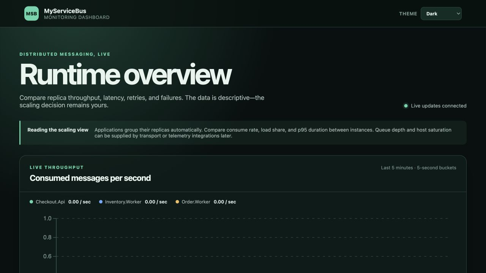
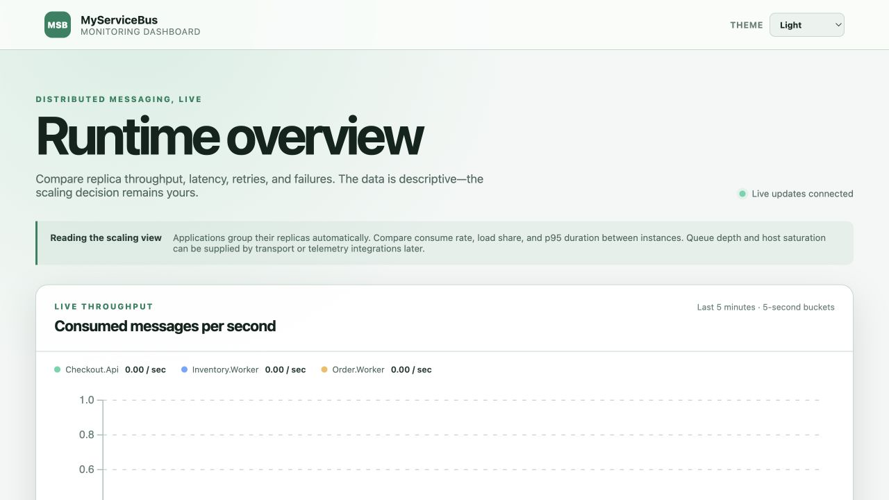

# Runtime Monitoring

MyServiceBus Monitoring is an optional, experimental addon that builds a distributed runtime view from participating MyServiceBus applications. Applications export current bus metadata, heartbeats, and bounded batches of observations to one central service. The standalone dashboard queries that service; it never connects to the applications directly.

```text
C# and Java applications
  -> general-purpose bus hooks
  -> optional monitoring exporters
  -> monitoring service (in-memory read model and HTTP API)
  -> standalone Blazor dashboard
```

Messaging does not depend on this path. If the monitoring service is unavailable or an export fails, message processing continues.

## MVP Status

The proof of concept is suitable to ship as an **experimental MVP**, not as a production monitoring system. The end-to-end Aspire stack has been exercised with C# and Java clients, RabbitMQ, the collector, HTTP queries, the WebSocket invalidation stream, and the Blazor dashboard.

The MVP includes:

- automatic application and instance registration from bus metadata
- current endpoint, consumer, message, binding, address, and transport metadata
- instance heartbeats and online/offline leases
- bounded client queues and interval/count-based observation batches
- cumulative and time-window sent, published, consumed, faulted, and retry metrics
- five-minute real-time throughput series with five-second buckets
- automatic replica grouping by application name and optional resource labels
- per-replica throughput, load share, p95 consume duration, retries, and failures
- observed cross-application message-flow reconstruction from correlation identifiers
- expandable failed-message metadata with endpoint, retry, exception, correlation, and trace details
- recent observations with optional W3C trace and span identifiers
- batch deduplication and reported dropped-observation counts
- HTTP ingest and query APIs
- WebSocket change invalidations
- a standalone Blazor runtime overview with persisted light, dark, and system themes
- equivalent exporter behavior for C# and Java
- first-class outbox dispatcher operations for embedded and standalone workers, including latest backlog, oldest-undispatched age, windowed throughput, failures, lost leases, and cycle latency

The MVP does not yet include authentication, durable storage, configurable retention, alerting or scaling recommendations, broker queue depth, host saturation, or payload-byte limits. The dashboard uses WebSocket invalidations to re-query HTTP snapshots, with a 15-second polling fallback.

## Dashboard Preview

The dashboard is usable in both dark and light environments. The selector persists an explicit light or dark preference locally; system mode follows the operating-system preference. The reconnect dialog uses the same theme tokens, so connection status remains legible while the server is unavailable.





The screenshots use generated monitoring records for fictional `Commerce` applications and instances. They contain no workstation, user, or production-system identity.

## Run the Complete Stack

From the repository root:

```bash
dotnet run --project src/AspireApp --launch-profile http
```

Open the Aspire dashboard URL printed by the command, then open the `monitoring-dashboard` resource. The AppHost starts RabbitMQ, the monitoring service, the Blazor dashboard, and the C# and Java sample applications. Both sample applications self-register after their buses start.

Use the sample applications' `/publish`, `/send`, and `/request` routes to create activity. The `/request/fault` route exercises fault handling. Export intervals make dashboard updates asynchronous; allow a few seconds for a batch and UI refresh.

## Enable the C# Exporter

Install the optional exporter package, then register the addon after the bus:

```bash
dotnet add package Sundstrom.MyServiceBus.Monitoring --version 0.1.0-preview.6
```

```csharp
builder.Services.AddServiceBus(configurator =>
{
    configurator.AddConsumer<SubmitOrderConsumer>();
    configurator.UsingRabbitMq((context, rabbit) =>
        rabbit.ConfigureEndpoints(context));
});

builder.Services.AddServiceBusMonitoring(options =>
{
    options.ServiceAddress = new Uri("http://monitoring-service:8080");
    options.ApplicationName = "Orders.Api";
    options.InstanceId = Environment.MachineName;
    options.Labels["group"] = "commerce";
    options.Labels["environment"] = "production";
});
```

The exporter is registered as both an `IBusHook` and a hosted background service. The hook only enqueues immutable events; the hosted worker performs HTTP export.

## Enable the Java Exporter

Reference `myservicebus-monitoring`, add monitoring before building the service provider, and start the exporter after the bus:

```groovy
implementation 'io.github.marinasundstrom.myservicebus:myservicebus-monitoring:0.1.0-preview.6'
```

```java
MonitoringExporterOptions monitoring = new MonitoringExporterOptions();
monitoring.setServiceAddress(URI.create("http://monitoring-service:8080"));
monitoring.setApplicationName("Orders.Worker");
monitoring.getLabels().put("group", "commerce");
monitoring.getLabels().put("environment", "production");

MonitoringExporter exporter = MonitoringServices.addMonitoring(services, monitoring);
ServiceProvider provider = services.buildServiceProvider();
MessageBus bus = provider.getRequiredService(MessageBus.class);

bus.start();
exporter.start(provider.getRequiredService(BusInspectionProvider.class));
```

Close the exporter during graceful application shutdown so it can make its bounded final flush.

## Identity, Replicas, and Labels

`ApplicationName` is the logical application identity. All running processes with the same application name are shown as replicas of that application. `InstanceId` identifies an individual replica, and `BusId` distinguishes a bus within that process. A bus address is displayed as transport context but is not used as the unique runtime identity.

Labels are optional bounded resource metadata. The dashboard recognizes `group` as a simple display grouping and also shows labels such as `environment` and `role`. Labels do not replace identity: the view is effectively `group → application → replicas`. Labels common to every replica are projected onto the application summary; conflicting instance labels remain visible only on those instances.

## General-Purpose Hooks

Hooks are a core extension seam, not a monitoring-specific API. Applications and other addons may implement `IBusHook` in C# or `BusHook` in Java to observe immutable lifecycle and message-operation events. Hook exceptions are isolated from message outcomes. A hook should return quickly and should not perform remote I/O on the message pipeline.

The monitoring exporter is one implementation of this seam. Its bounded local queue, batching, heartbeats, and collector protocol remain in the optional monitoring package.

Outbox dispatcher monitoring is implemented for C# and Java delivery services. Each polling cycle contributes one bounded observation for its logical service partition and worker owner. The collector combines the latest backlog snapshot with windowed lease, dispatch, failure, and lost-lease counts, and the dashboard presents those signals in **Dispatcher operations**. Embedded delivery and standalone worker fleets use the same model, so a slow or undersized dispatcher remains visible as a delivery bottleneck.

The monitoring service never connects directly to application databases or mutates persistence state. Message bodies, arbitrary headers, persisted record identities, SQL, and connection details remain excluded. Inbox duplicate outcomes, cleanup progress, alerting, and durable monitoring history are not yet implemented. See the [runtime monitoring proposal](proposals/runtime-monitoring.md#outbox-and-inbox-operations) for the longer-term boundary.

## Service API

The prototype uses `/api/monitoring/v1` for both ingest and query operations.

| Method | Route | Purpose |
| --- | --- | --- |
| `POST` | `/metadata` | Register or replace an instance's bus metadata |
| `POST` | `/observations:batch` | Submit one sequenced observation batch |
| `POST` | `/heartbeat` | Renew an existing instance lease |
| `GET` | `/applications` | Query application aggregates |
| `GET` | `/instances?application=...` | Query application instances |
| `GET` | `/metadata/{application}/{instanceId}/{busId}` | Query current bus metadata |
| `GET` | `/observations?application=...&limit=100` | Query recent observations |
| `GET` | `/metrics?application=...&windowSeconds=60&byInstance=true` | Query bounded-window rates, counts, and consume latency |
| `GET` | `/metrics/timeseries?windowSeconds=300&bucketSeconds=5` | Query bucketed rates for real-time graphs |
| `GET` | `/flow?application=...&windowSeconds=300` | Query observed correlated application flow |
| `GET` | `/outbox?application=...&windowSeconds=60` | Query dispatcher state and windowed outbox throughput |
| WebSocket | `/stream` | Receive change invalidations |

WebSocket messages indicate that metadata or observations changed; clients should re-query the authoritative HTTP read model. They are not a durable event stream.

The in-memory service retains metric buckets for 15 minutes and bounds its recent observation buffer. A `Complete` flag on window summaries reports whether the exporter has declared dropped observations. A zero rate with incomplete coverage must not be interpreted as proven inactivity.

## OpenTelemetry Boundary

MyServiceBus has OpenTelemetry tracing support independently of the monitoring addon. The C# and Java clients create producer spans for send and publish operations, create consumer spans while handling messages, and propagate W3C trace context in message headers. When an application sends or publishes from inside a consumer, that new producer span inherits the active consumer span.

For example, one distributed trace can show this causal path:

```text
HTTP request → Checkout.Api
  └─ send SubmitOrder
      └─ consume SubmitOrder → Order.Worker
          └─ publish OrderAccepted
              └─ consume OrderAccepted → Inventory.Worker
```

This answers a different question from the monitoring overview. The dashboard shows the current shape and behavior of the system—applications, replicas, rates, latency, retries, failures, and observed aggregate flow. An OpenTelemetry backend shows the path and timing of one particular operation across service and messaging boundaries, including the work that caused the next message.

When running the repository through Aspire, open the Aspire dashboard's telemetry trace view to inspect this complete request-and-message chain. The inbound HTTP span, MyServiceBus producer and consumer spans, and any other instrumented application work appear together in the same trace, provided every participating service exports the propagated context. The MyServiceBus monitoring dashboard remains the aggregate runtime overview alongside that per-operation Aspire view.

The monitoring service does not receive or store OpenTelemetry spans. MyServiceBus observations may carry trace and span identifiers already present in a messaging operation. The dashboard currently surfaces those identifiers as correlation metadata on failures; a future provider can turn them into links to an independently configured tracing backend without making that backend part of the monitoring collector.

This keeps the monitoring service focused on MyServiceBus topology and runtime state while existing OpenTelemetry collectors and backends continue to own traces, metrics, and logs.

Failed-message inspection intentionally excludes message bodies and arbitrary headers. The prototype exposes only operational metadata already present in hook observations: message identity, endpoint, retry attempt, exception detail, correlation, conversation, and trace identifiers.

## Deployment and Security Boundary

The collector and dashboard are independently deployable applications, not client-library packages. Versioned Linux images for AMD64 and ARM64 are published separately:

```text
ghcr.io/marinasundstrom/myservicebus-monitoring-collector:0.1.0-preview.6
ghcr.io/marinasundstrom/myservicebus-monitoring-dashboard:0.1.0-preview.6
```

The collector listens on port `8080`. The dashboard also listens on port `8080` and reads its collector base address from the `MonitoringService` configuration key (for example, the `MonitoringService` environment variable). The current in-memory collector is intended for local development and controlled evaluation. Before exposing it outside a trusted network, add host-level authentication and authorization, request and payload limits, TLS, durable persistence if history is required, and an explicit retention policy. Do not send message bodies, arbitrary headers, credentials, or broker-management data through the monitoring protocol.

For the longer-term design and vocabulary, see the [Runtime Monitoring Proposal](proposals/runtime-monitoring.md).
