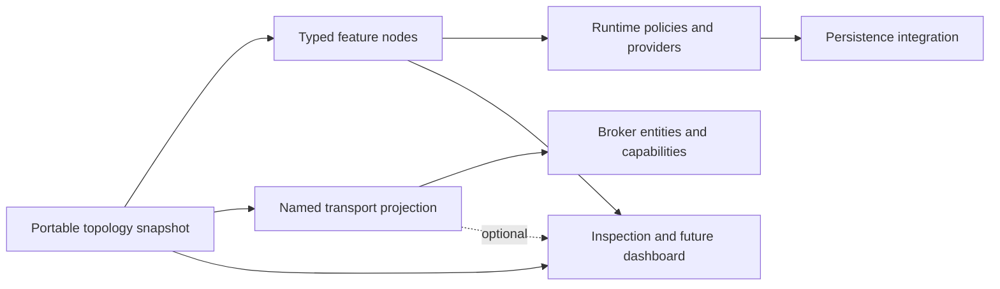

# Topology Extension Model

## Purpose

This specification validates the stable topology foundation against likely future saga, outbox, and durable-broker requirements without committing MyServiceBus to those implementations. It defines where new facts belong so future features remain queryable across languages and do not couple portable topology to a persistence provider or broker.

The extension model has three boundaries:

1. Portable feature nodes describe configured messaging intent and relationships.
2. Transport-profile projections describe how portable intent becomes broker entities.
3. Runtime provider descriptors identify integrations without exposing provider objects, callbacks, credentials, or connection state.

The normalized snapshot remains useful when feature nodes or transport projections are absent. Extensions add information; they do not redefine message, endpoint, consumer, or binding identity.

## Extension Rules

- A portable concept with cross-language meaning receives a typed, versioned node rather than an unstructured property bag.
- A broker concept belongs to a named transport projection and is never required to understand the portable graph.
- A persistence integration is represented by stable identifiers and declared requirements, never by a data-source, session, transaction, callback, or framework object.
- Secrets, connection strings, runtime health, and mutable counters are not topology. They belong to configuration, health, telemetry, or monitoring.
- New node collections and optional fields are additive under the topology versioning rules. Changing identity or the meaning of an existing field requires a new snapshot version.
- C# and Java expose recognizable counterpart concepts but may use different builders, factory patterns, collections, and package organization.

## Saga Validation

A future saga extension requires these portable facts:

| Node or relationship | Portable data |
| --- | --- |
| Saga | stable ID, saga type identity, correlation contract, endpoint ID |
| State machine | stable ID, state-machine type identity, saga ID, initial state |
| Consumed contract | saga or state-machine ID, message ID, correlation rule identity |
| Produced contract | saga or state-machine ID, message ID, operation kind |
| Persistence requirement | provider kind ID, consistency requirement, concurrency strategy |

Correlation expressions, repository instances, ORM sessions, compiled delegates, and state-machine executable code stay in the language runtime. Inspection can show that a saga consumes a contract at an endpoint and requires optimistic concurrency without learning how either client implements it.

Saga support therefore extends the portable graph; it does not require changing endpoint, consumer, message, or binding identity.

## Outbox Validation

A future outbox extension requires a policy attached to a bus, endpoint, or consumer scope:

| Field | Meaning |
| --- | --- |
| stable ID | identity for joins and inspection |
| scope | bus, endpoint, or consumer attachment |
| guarantee | configured delivery/duplication guarantee |
| persistence kind | stable provider category, not an implementation type |
| ordering scope | what ordering the policy promises |
| duplicate-detection intent | whether inbox-style deduplication is required |

The outbox is a delivery policy, not a broker binding. It may affect when sends are released and which persistence capabilities startup must validate, but it does not change message URNs or portable endpoint identity. Provider configuration and transaction handles remain outside topology snapshots.

## Second Durable Broker Validation

Azure Service Bus is used as the stress case because its topology differs materially from RabbitMQ. This is model validation, not a transport commitment.

| Portable intent | RabbitMQ projection | Azure Service Bus projection |
| --- | --- | --- |
| endpoint name | queue | queue, or subscription identity when receiving published messages |
| publish binding | fanout exchange and queue binding | topic, subscription, and rule/filter |
| durable/temporary | durable and auto-delete entity settings | entity lifetime and auto-delete-on-idle constraints |
| terminal failure | MyServiceBus `_error` topology | native dead-letter or compatibility forwarding policy |
| scheduling | delayed-delivery emulation/profile choice | native scheduled enqueue |
| ordering requirement | queue/channel ordering constraints | session requirement and session key policy |
| transport options | queue arguments | sessions, duplicate detection, partitioning, lock duration, rule options |

The current `ReceiveEndpointTransportTopology` is sufficient as the portable runtime input because it carries endpoint identity, durability/temporary intent, bindings, prefetch, and adapter-owned options. An Azure Service Bus adapter would project those facts into its own typed topology and reject unsupported combinations through capability validation. It must not add topic, subscription, session, or dead-letter fields to the portable endpoint snapshot.

## Inspection Contract

Inspection reads portable feature nodes directly. A transport projection may be attached as optional, profile-versioned detail supplied by the adapter. If no projection is registered, inspection reports portable topology without guessing broker settings.

Dashboard code must tolerate:

- unknown feature-node kinds from a newer client
- absent transport details
- different projections for equivalent portable intent
- provider identifiers it does not recognize
- mixed client versions within the supported snapshot contract

## Validation Result

The version 1 topology foundation passes this prospective validation:

- Saga support can add typed nodes and relationships without redefining existing identities.
- Outbox support can add scoped delivery-policy nodes without becoming transport topology.
- A materially different durable broker can add a named projection and capability constraints without changing the portable endpoint model.
- Inspection can display all three through additive data and remain useful when optional details are absent.

No saga, outbox, or second-broker API should be added until its behavior, failure semantics, persistence boundary, and cross-language conformance fixtures are specified. This validation reserves architectural space; it is not a feature commitment.
