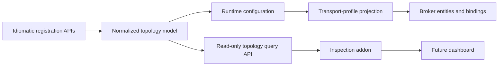

# Topology Model Specification

## Purpose

MyServiceBus exposes topology as a first-class, queryable model shared by its language clients. The model is the authoritative description of configured messaging intent: contracts, receive endpoints, consumers, and their bindings. Runtime transport adapters project that intent into broker entities, while inspection and future dashboards query the same model instead of reconstructing topology from transport conventions.

The C# and Java APIs should use recognizable counterpart concepts and types wherever natural. Their syntax, collection types, mutability patterns, builders, packages, and lifecycle integration remain idiomatic to each platform.

## Stability Boundary

The topology model is part of the stable foundation required before expanding inspection, adding a second transport, or implementing higher-level features such as sagas and outbox behavior.

Stability applies to:

- the meaning and identity of topology nodes
- relationships between contracts, endpoints, consumers, and bindings
- language-neutral snapshot fields and serialization
- deterministic query results after configuration is complete
- additive extension rules for transport- and feature-specific data

Stability does not require exposing mutable runtime implementation objects, configuration callbacks, delegates, serializers, broker clients, or dependency-injection registrations.

## Portable Model

The normalized model contains these corresponding concepts:

| Concept | Required portable data |
| --- | --- |
| Bus topology | model version, messages, receive endpoints, consumers, bindings |
| Message topology | stable contract identity, message URN, entity name, implemented contract identities |
| Receive endpoint topology | stable endpoint identity, endpoint name, logical address, durability intent, temporary intent, bindings, attached consumers |
| Consumer topology | stable consumer identity, consumer type identity, endpoint identity, consumed contract identities |
| Message binding | endpoint identity, contract identity, entity name, binding kind |

Type objects such as .NET `Type` and Java `Class<?>` may remain available in language-native configuration APIs, but language-neutral queries use stable string identities and message URNs. Callback/delegate fields are runtime configuration and are never part of the normalized snapshot.

## Model and Transport Projection

Portable endpoint intent must not contain fields that only make sense for one broker. For example, an endpoint may declare that it is durable or temporary, but `fanout`, routing keys, queue arguments, subscriptions, sessions, partitions, and dead-letter settings belong to a named transport projection.

Transport details are additive and namespaced by profile. A RabbitMQ projection may describe exchange type and routing key; Azure Service Bus may describe topic, subscription, session, and rule details. Consumers of the portable model must remain useful when those details are absent or unknown.

The runtime passes `ReceiveEndpointTransportTopology` to transport factories in both reference clients. It contains endpoint name, durability and temporary intent, bindings, prefetch, and an opaque transport-options bag. The options bag is runtime configuration for the selected adapter and is excluded from the normalized snapshot; it must never be interpreted by portable inspection code.

RabbitMQ projects that intent into `RabbitMqReceiveEndpointTopology`, applying `fanout` exchange and empty routing-key defaults for MassTransit-compatible publish bindings. Projection validates profile constraints before opening a broker connection, and all RabbitMQ provisioning consumes the projected value. Legacy C# broker-shaped and Java parameter-list transport overloads remain compatibility adapters, not the runtime's source of topology intent.

## API Directive

Each client must provide:

- a read-only bus-topology entry point
- deterministic enumeration or query of messages, endpoints, consumers, and bindings
- stable identities suitable for joining nodes without relying on object identity
- a snapshot boundary so callers do not observe configuration mutating underneath a query
- corresponding public concepts across C# and Java, with idiomatic naming and collection APIs

The mutable registration registry and the public query model may be separate types. This is preferred when it prevents configuration callbacks or implementation state from leaking into the stable API.

The initial C# and Java query entry points are `IBusTopology.GetSnapshot()` and `BusTopology.getSnapshot()`. They return versioned immutable snapshot records with corresponding message, receive-endpoint, consumer, and binding nodes. Version 1 uses `endpoint:<name>` endpoint identities, message URNs as contract identities, and logical `queue:<name>` endpoint addresses. These logical addresses are not serialized broker addresses.

The mutable registries retain corresponding `ReceiveEndpointDefinition` records as the source of normalized durability and temporary intent. Consumer registration currently creates the durable, non-temporary service-endpoint definition supported by both reference runtimes. Additional public endpoint-intent configuration must not be exposed until both transport contracts can validate and honor it.

The C# and Java inspection adapters consume this snapshot rather than rebuilding topology from mutable registration state. Their endpoint addresses are therefore logical addresses. Transport inspection data remains absent until a transport supplies an authoritative projection; inspection must not invent exchange types, routing keys, durability, or error-queue conventions from the bus address.

## Evolution

`TopologySnapshot.CurrentVersion` in C# and `TopologySnapshot.CURRENT_VERSION` in Java identify the newest snapshot version emitted by each client. Both constants must advance together and their canonical fixtures must land in the corresponding `test/fixtures/topology/v<version>` directory.

Evolution follows these rules:

- Adding an optional field or a new extension entry does not change the version. Readers must ignore unknown fields and continue to operate when optional data is absent.
- Adding a required field, removing a field, changing a field's meaning or type, or changing stable identity construction requires a new version.
- Writers emit exactly one declared version. Readers may accept older versions through an explicit adapter, but must not silently reinterpret an unsupported newer version.
- Transport projections and feature extensions are namespaced and additive. They never replace portable node identity or redefine portable fields.
- C# and Java publish the same version only when they serialize the same language-neutral contract and pass the same canonical fixtures.

Snapshot versioning is independent from package versions, the MassTransit envelope format, and individual transport-profile versions. A change in one contract does not imply a change in the others.

Sagas should extend the model with saga/state-machine identities, consumed and produced contracts, endpoint attachment, and persistence requirements. Outbox support should expose its configured delivery guarantee, scope, and persistence integration without leaking provider objects. New transports add projections and capability data; they do not redefine portable node identity.

## Conformance

C# and Java topology conformance tests must build equivalent configurations and compare canonical language-neutral snapshots. The version 1 fixtures live under `test/fixtures/topology/v1`. Tests must cover ordering, stable identities, implemented contracts, multiple consumers on one endpoint, transport extensions, and omission of runtime-only callbacks. The same fixtures become inputs for inspection and dashboard tests later.
